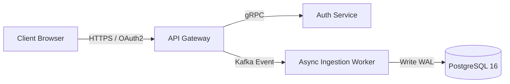

# visual-assets

## Core Philosophy
Visual assets for software and technical products are not decorative digital clip art. They are high-leverage communication tools that establish immediate credibility, clarify complex system architectures, and drastically increase click-through rates across social, documentation, and search environments. Every asset—from an Open Graph preview card to an enterprise architecture diagram—must prioritize clarity, contrast, and information density over generic aesthetic flair.

---

## 4-Step Visual Asset Design System

### Step 1: Design Tokens & Visual Hierarchy
1. **Strict Palette Standardization**:
   - *Backgrounds*: Deep neutral slate/charcoal (e.g. `#0F172A`, `#18181B`) or crisp clean white (`#FFFFFF`).
   - *Primary Accent*: 1 vibrant brand color (e.g. Indigo `#6366F1`, Emerald `#10B981`, or Electric Orange `#F97316`) reserved exclusively for callouts and focal points.
   - *Text Contrast*: Ensure all text meets WCAG AA standards (minimum 4.5:1 contrast ratio against background).
2. **Typography Rules**:
   - Monospace font for all code blocks, CLI snippets, and data points (`JetBrains Mono`, `Fira Code`, or `Geist Mono`).
   - Clean geometric sans-serif for headings and labels (`Inter`, `Geist`, or `Plus Jakarta Sans`).

### Step 2: Open Graph (OG) & Social Card Architecture
1. **Canvas Specifications**:
   - Resolution: 1200x630px (1.91:1 aspect ratio), PNG or WebP format.
   - Safe Zone: Keep critical text and logos within the central 1000x500px box to prevent clipping on mobile previews.
2. **Visual Anatomy of a High-CTR Developer OG Card**:
   - High-contrast headline (48–64pt font, maximum 8 words).
   - Category / Feature badge pill at top left.
   - Code snippet preview or syntax-highlighted terminal window as secondary visual weight.
   - Product logo and author/brand avatar at bottom.
3. **Automated Dynamic OG Generation**:
   - Implement dynamic edge-generated OG images (e.g. `@vercel/og`, Satori, or Puppeteer templates) to render title, tags, and reading time dynamically for documentation and blog posts.

### Step 3: Technical Architecture & System Diagrams
1. **Diagram Engineering Discipline**:
   - Use clean vector tools (Mermaid.js, Figma, or Excalidraw).
   - Enforce unidirectional flow (left-to-right for user pipelines, top-to-bottom for microservice hierarchies).
   - Node Standardization: Use consistent geometric shapes (Rectangles = Services/APIs, Cylinders = Databases/Storage, Diamonds = Decision logic).
   - Label Every Arrow: Never leave an arrow unlabeled; explicitly indicate protocol and payload (e.g., `HTTPS / JSON`, `gRPC`, `Kafka Event`).

### Step 4: Product Screenshots & Marketing Assets
1. **Screenshot Framing & Mockups**:
   - Avoid generic laptop/browser mockup frames with distorted 3D perspective angles.
   - Use flat, 2D borderless UI crops with subtle 1px border (`#27272A`) and soft box-shadow (`box-shadow: 0 20px 25px -5px rgba(0, 0, 0, 0.5)`).
   - Redact sensitive data (API keys, personal customer names) with clean neutral rectangles, not messy pixelation.
2. **Asset Compression Pipeline**:
   - Convert all raster images to WebP or AVIF.
   - Run lossless compression (using `oxipng` for PNGs or `cwebp -q 85` for WebP) to ensure image files remain $< 150text{KB}$ for web performance.

---

## Deliverable Format: Visual Asset Specification (`VISUAL-ASSETS-SPEC.md`)

```markdown
# Visual Asset & Design Specification: [Product / Feature]

## 1. Brand Tokens & Palette
- **Canvas Background**: `#090D16` (Deep Navy Slate)
- **Primary Accent**: `#38BDF8` (Sky Blue)
- **Surface Border**: `#1E293B` (1px solid)
- **Primary Typography**: `Inter` / `JetBrains Mono`

## 2. Asset Manifest & Specifications
| Asset Name | Dimensions | Format | Usage Context | Delivery Path |
|---|---|---|---|---|
| `og-main.png` | 1200x630px | WebP / PNG | Social previews & meta tags | `public/og/` |
| `architecture-v1.svg` | Vector | SVG | README & Documentation | `docs/assets/` |
| `feature-cli-hero.png`| 1920x1080px| WebP | Homepage Hero Section | `public/img/` |

## 3. Diagram Flow Specifications (Mermaid)


## 4. Screenshot Sanitation & Framing Rules
- **Shadow**: `0 25px 50px -12px rgba(0,0,0,0.4)`
- **Border Radius**: `12px`
- **Zoom Level**: 125% browser zoom for crisp UI rendering
```

---

## Worked Example: Developer Documentation OG Card Template

- **Design**: Dark theme background (`#0A0A0A`) with subtle radial gradient.
- **Content**: Left side contains dynamic H1 page title in 56pt `Geist` font with a "Documentation" badge; right side contains a syntax-highlighted code block showcasing the specific API endpoint discussed on the page.
- **Impact**: Increased organic Twitter/X click-through rate from 1.8% to 4.9% across shared documentation links.

---

## Verification Checklist

- [ ] All text passes WCAG AA contrast ratio standards ($\ge 4.5:1$).
- [ ] OG cards are 1200x630px with critical text within the 1000x500px safe zone.
- [ ] Architecture diagrams have clearly labeled arrows indicating protocols and data flow.
- [ ] Product screenshots use flat 2D presentation with sensitive data cleanly redacted.
- [ ] Web images are compressed to WebP/AVIF and weigh $< 150text{KB}$.

---

## Anti-Patterns

- **AI Sci-Fi Slop**: Using generic AI-generated images of floating neon brains or glowing cyber-cubes that communicate zero technical meaning.
- **Microscopic 4K Screenshots**: Taking a full-monitor 4K screenshot of a UI where the actual feature is unreadable on mobile.
- **Unlabeled Diagram Arrows**: Connecting 15 boxes with mysterious arrows that leave readers guessing what data is moving where.
